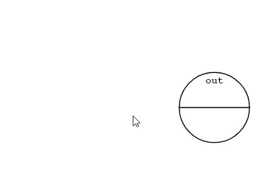
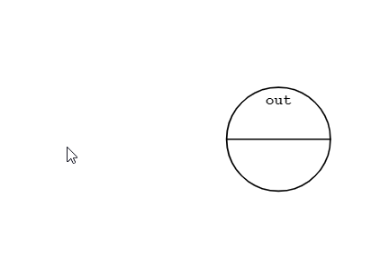
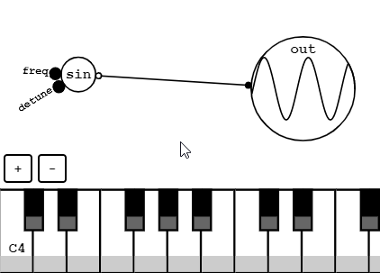
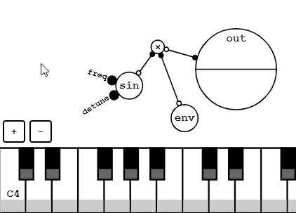
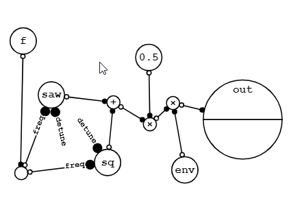
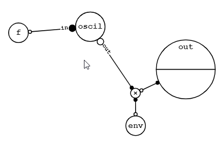
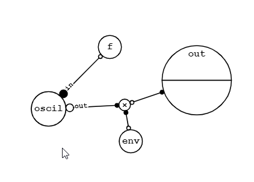
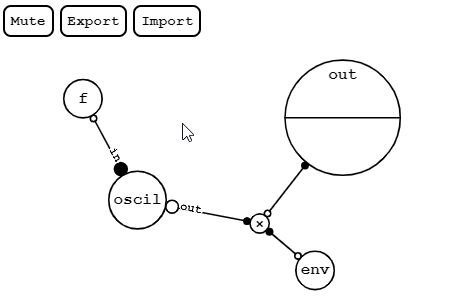

[GraphSynth](https://saharan.github.io/GraphSynth/)
--

A node-based graphical synthesizer.

## How to use
1. Unmute your device first and click `Play`.  

1. Long press to open the menu.  

1. Connect oscillators to the output node.  

1. Connect envelopes to control volume by the keyboard.  

1. Connect input frequency to oscillators to change their frequency by the keyboard.  

1. Make modules to simplify your graph.  

1. Copy & paste modules and other nodes.  

1. Edit modules from inside. Note that you can nest modules.  

1. Save your work by text.  

## License
The MIT License
