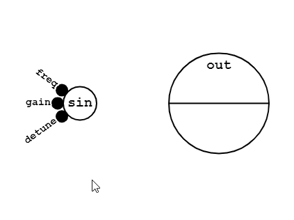
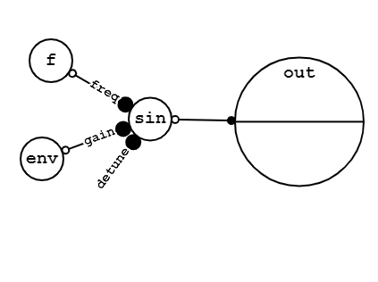
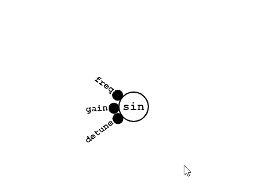
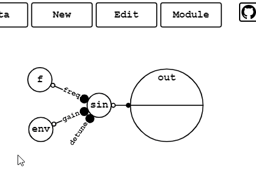
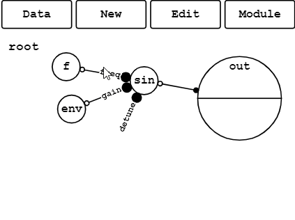
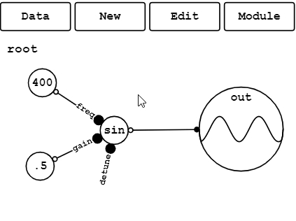
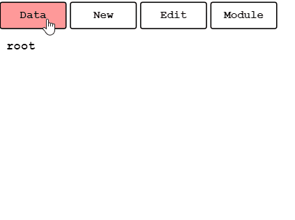

[GraphSynth](https://saharan.github.io/GraphSynth/)
--

A node-based graphical synthesizer.

## How to use
1. Move a node by dragging.  
ドラッグでノードを動かします。  

1. Connect nodes by dragging a node to another node.  
ドラッグでノードを他のノードに接続します。  

1. Cut cables and remove nodes by slashing.  
スラッシュでケーブルを切断またはノードを除去します。  

1. Select multiple nodes and move them.  
複数ノードを選択して同時に動かします。  

1. Tap a node twice to open the edit menu.  
ノードを2回タップして編集画面を開きます。  

1. Modulize a part of the graph.  
グラフの一部をモジュール化します。  

1. Go inside and outside a module.  
モジュールを出入りします。  

1. Copy and paste a part of the graph.  
グラフの一部をコピペで増やします。  

1. Save and load graphs.  
グラフの保存・読み込みを行います。  

1. Open examples and have fun!  
サンプルを開いて遊んでみましょう！  

## Tips
* On mobile devices, use two fingers to translate and scale the view.  
モバイル端末では、二本指でビューの移動と拡大縮小ができます。
* Some usual keyboard shortcuts are available on PCs.  
PCでは、よくあるショートカットキーをいくつか使うことができます。

## License
The MIT License
