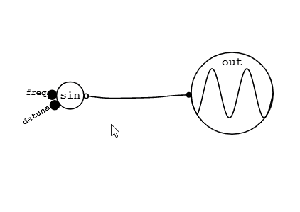

[GraphSynth](https://saharan.github.io/GraphSynth/)
--

A node-based graphical synthesizer.

## How to use
1. Unmute your device first and click `Play`.  
デバイスのミュートを解除して `Play` ボタンを押して開始します。  

1. Long tap to open the menu.  
長押しでメニューが開きます。  

1. Connect oscillators to the output node.  
**Double tap and drag** to connect nodes and cables.  
オシレータを出力ノードに繋げると音が鳴ります。  
**ダブルタップしてから離さずにドラッグ**すると線を繋ぎます。  

1. Double tap cables to cut them.  
線をダブルタップすると切れます。  

1. Connect envelopes to control volume by the keyboard.  
エンベロープを繋げるとキーボードで音量を操作できます。  

1. Connect `input frequency` to oscillators to change their frequency by the keyboard.  
`input frequency` ノードをオシレータに繋ぐことでキーボードで音階を操作できます。  

1. Make modules to simplify your graph.  
ノードをモジュールにしてまとめることでグラフを整理できます。  

1. Copy & paste modules and other nodes.  
モジュールやその他のノードはコピペで増やすことができます。  

1. Edit modules from inside. Note that you can nest modules.  
モジュールは内部から編集することができます。モジュールを入れ子にすることもできます。  

1. Save your work by text.  
作ったものはテキストで保存することができます。  

## License
The MIT License
